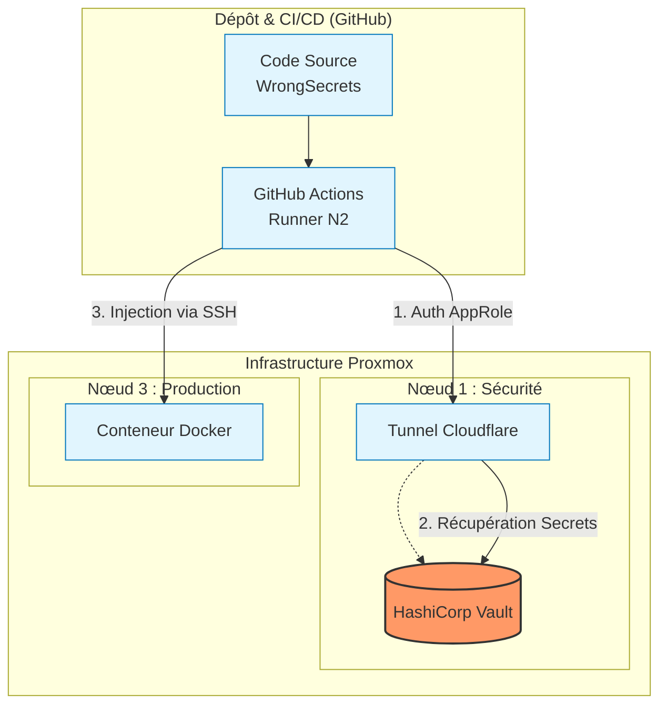

# 🛡️ Pipeline DevSecOps - Déploiement Sécurisé de WrongSecrets

Ce projet met en place une chaîne d'intégration et de déploiement continus (CI/CD) automatisée pour l'application **OWASP WrongSecrets**. L'objectif est de sécuriser l'injection des secrets (mots de passe, clés API) en utilisant **HashiCorp Vault** au lieu de les stocker en clair dans le code source ou les variables GitHub.

## 🏗️ Architecture

Le déploiement s'articule autour d'une infrastructure Proxmox isolée :

## 🚀 Fonctionnalités
Audit de sécurité : Analyse du code à chaque push pour détecter les secrets exposés (via Gitleaks).

Gestion des secrets : Utilisation de HashiCorp Vault avec authentification AppRole.

Déploiement Automatisé : Injection dynamique des secrets dans le conteneur Docker cible sans stockage persistant sur le disque.

Connectivité Sécurisée : Tunnel Cloudflare (cloudflared) pour exposer Vault sans ouvrir de ports vulnérables sur l'infrastructure.

## ⚙️ Procédure de démarrage (Routine de production)
En cas de redémarrage des conteneurs, exécute les commandes suivantes sur le Nœud 1 (Vault) :

Démarrer Vault : systemctl start vault

Déverrouillage (Unseal) :

Bash
export VAULT_ADDR='[http://127.0.0.1:8200](http://127.0.0.1:8200)'
vault operator unseal # Répéter 3 fois avec les clés de déverrouillage
Lancer le tunnel :

Bash
nohup ./cloudflared tunnel --url [http://127.0.0.1:8200](http://127.0.0.1:8200) > cloudflare.log 2>&1 &

## 🛠️ Stack Technique
CI/CD : GitHub Actions

Sécurité : HashiCorp Vault (Secrets Engine)

Virtualisation : Proxmox (Conteneurs LXC)

Conteneurisation : Docker

Réseau : Cloudflare Tunnel (cloudflared)

## 📝 Journal de bord technique (Lessons Learned)
Gestion Réseau : Résolution de problèmes d'isolation entre conteneurs LXC et gestion des adresses IP dynamiques.

Sécurité SSH : Configuration de sshd_config (PermitRootLogin yes) nécessaire pour le déploiement automatisé.

Docker : Mise à jour vers l'image :latest-no-vault suite à la réorganisation du dépôt officiel OWASP.

## 🔐 Configuration GitHub Secrets
Pour exécuter cette pipeline, les secrets suivants doivent être configurés dans **Settings > Secrets and variables > Actions** de ton dépôt :

* `VAULT_ADDR` : L'URL publique de ton tunnel Cloudflare (ex: `https://...trycloudflare.com`).
* `VAULT_ROLE_ID` : L'identifiant AppRole pour l'authentification Vault.
* `VAULT_SECRET_ID` : Le secret correspondant à l'AppRole.
* `DB_PASSWORD` : Mot de passe de la base de données injecté dynamiquement.
* `API_KEY` : Clé API injectée dynamiquement.

## ✅ Vérification du déploiement
Une fois la pipeline terminée en succès :
1. Accéder à l'application via : `http://10.101.1.138:8080`.
2. Vérifier que les secrets ont été correctement injectés (via l'interface de l'application WrongSecrets).
3. Consulter les logs de la pipeline pour valider l'exécution réussie de l'Audit Gitleaks (qui échoue volontairement pour signaler les secrets détectés).

## 🔧 Troubleshooting (Problèmes rencontrés)
* **Connexion SSH refusée :** Vérifier que `openssh-server` est installé sur le Nœud 3 et que `PermitRootLogin yes` est activé dans `/etc/ssh/sshd_config`.
* **Problèmes de Ping/Réseau :** Vérifier la configuration des interfaces réseau dans Proxmox (Bridge `vmbr0`) et s'assurer que le pare-feu Proxmox au niveau de l'interface réseau est désactivé si l'isolation est trop stricte.
* **Erreur Docker "Not Found" :** S'assurer que le tag de l'image Docker est à jour (utilisation actuelle : `:latest-no-vault`).

## ⚠️ Note sur l'Audit de Sécurité
Le job "Audit & Scan" est configuré avec `continue-on-error: true`. Il est normal qu'il apparaisse en "échec" (Code 1) car il détecte volontairement des secrets dans le dépôt. Cela valide le fonctionnement de l'outil Gitleaks comme mesure de protection.
